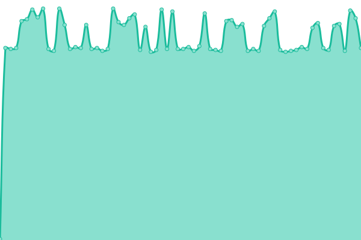

# [📈 Live Status](https://status.shimul.me): <!--live status--> **🟧 Partial outage**

This repository contains the open-source uptime monitor and status page for [Shimul](https://status.shimul.me), powered by [Upptime](https://github.com/upptime/upptime).

With [Upptime](https://upptime.js.org), you can get your own unlimited and free uptime monitor and status page, powered entirely by a GitHub repository. We use [Issues](https://github.com/shimuldn/upptime-personal/issues) as incident reports, [Actions](https://github.com/shimuldn/upptime-personal/actions) as uptime monitors, and [Pages](https://status.shimul.me) for the status page.

<!--start: status pages-->
<!-- This summary is generated by Upptime (https://github.com/upptime/upptime) -->
<!-- Do not edit this manually, your changes will be overwritten -->
<!-- prettier-ignore -->
| URL | Status | History | Response Time | Uptime |
| --- | ------ | ------- | ------------- | ------ |
|  Whoogle Search - Personal | 🟩 Up | [whoogle-search-personal.yml](https://github.com/shimuldn/upptime-personal/commits/HEAD/history/whoogle-search-personal.yml) | 

 1088ms
     
 | 

<a href="https://status.shimul.me/history/whoogle-search-personal">100.00%</a>
    

|  Searx Search - Personal | 🟩 Up | [searx-search-personal.yml](https://github.com/shimuldn/upptime-personal/commits/HEAD/history/searx-search-personal.yml) | 

 820ms
     
 | 

<a href="https://status.shimul.me/history/searx-search-personal">100.00%</a>
    

|  Piped Youtube - Personal | 🟩 Up | [piped-youtube-personal.yml](https://github.com/shimuldn/upptime-personal/commits/HEAD/history/piped-youtube-personal.yml) | 

 662ms
     
 | 

<a href="https://status.shimul.me/history/piped-youtube-personal">100.00%</a>
    

|  Adguard DNS Ocean - Personal | 🟩 Up | [adguard-dns-ocean-personal.yml](https://github.com/shimuldn/upptime-personal/commits/HEAD/history/adguard-dns-ocean-personal.yml) | 

 224ms
     
 | 

<a href="https://status.shimul.me/history/adguard-dns-ocean-personal">100.00%</a>
    

|  Adguard DNS D - Personal | 🟥 Down | [adguard-dns-d-personal.yml](https://github.com/shimuldn/upptime-personal/commits/HEAD/history/adguard-dns-d-personal.yml) | 

 212ms
     
 | 

<a href="https://status.shimul.me/history/adguard-dns-d-personal">54.92%</a>
    

|  Adguard DNS P - Personal | 🟩 Up | [adguard-dns-p-personal.yml](https://github.com/shimuldn/upptime-personal/commits/HEAD/history/adguard-dns-p-personal.yml) | 

 221ms
     
 | 

<a href="https://status.shimul.me/history/adguard-dns-p-personal">100.00%</a>
    

<!--end: status pages-->

[**Visit our status website →**](https://status.shimul.me)

## 📄 License

- Powered by: [Upptime](https://github.com/upptime/upptime)
- Code: [MIT](./LICENSE) © [Shimul](https://status.shimul.me)
- Data in the `./history` directory: [Open Database License](https://opendatacommons.org/licenses/odbl/1-0/)
